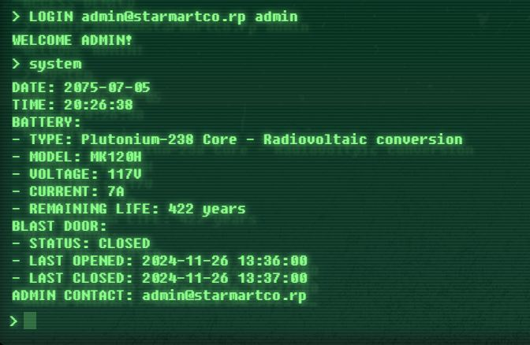
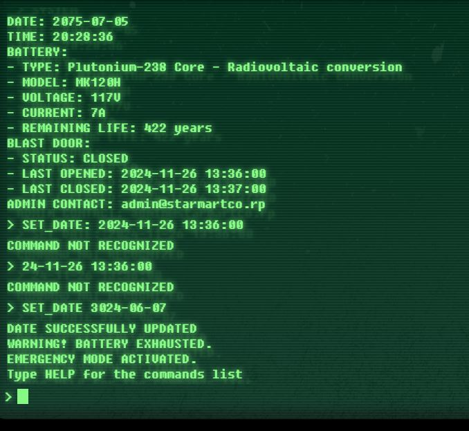
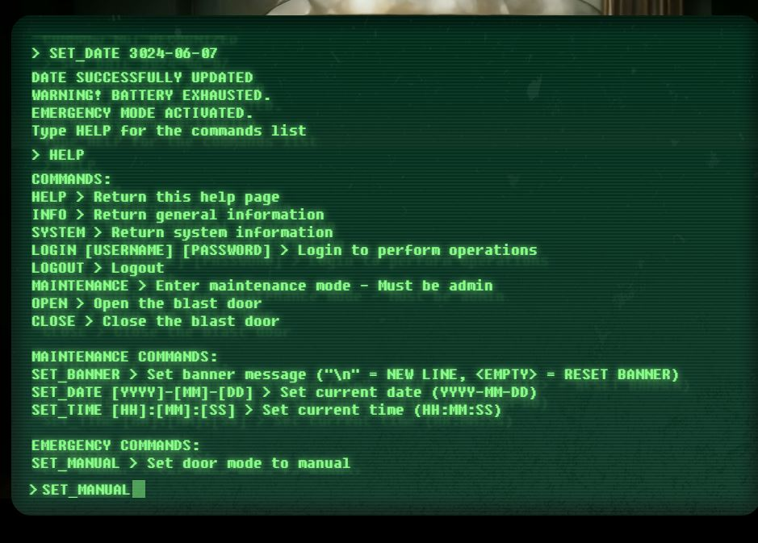
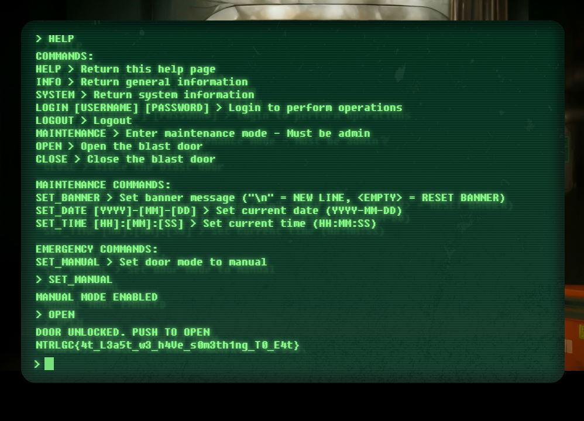

## Warehouse

Let's open the terminal.

    HELP

Let's see...

    SYSTEM

Ok the username is `admin@starmartco.rp`. 

Let's try some default password. Ok `admin` works:

    LOGIN admin@starmartco.rp admin

Let's enter maintenance mode:

    MAINTENANCE

Let's override the current date to a date after the battery life:

    SET_DATE 2800-01-01

Uh oh.

    HELP
    SET_MANUAL
    OPEN

