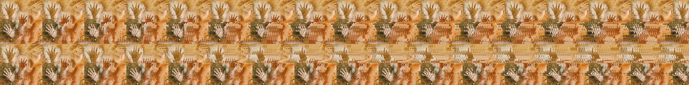
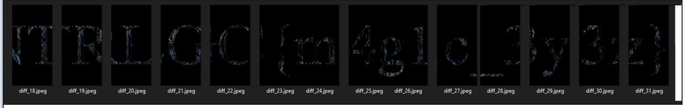

# Echoes of the past - Stereogram
By viewing the image as a series of horizontal (NOT vertical) slides, you can see that there is a difference between each one and the next.
Then I split the images to have individual frames with Python using this code:

```
import cv2
path_to_img = "echoesofthepast.jpg"
img = cv2.imread(path_to_img)
img_h, img_w, _ = img.shape
split_width = 171
split_height = 350


def start_points(size, split_size, overlap=0):
    points = [0]
    stride = int(split_size * (1-overlap))
    counter = 1
    while True:
        pt = stride * counter
        if pt + split_size >= size:
            if split_size == size:
                break
            points.append(size - split_size)
            break
        else:
            points.append(pt)
        counter += 1
    return points


X_points = start_points(img_w, split_width, 0)
Y_points = start_points(img_h, split_height, 0)

count = 0
name = 'splitted'
frmt = 'jpeg'

for i in Y_points:
    for j in X_points:
        split = img[i:i+split_height, j:j+split_width]
        cv2.imwrite('{}_{}.{}'.format(name, count, frmt), split)
        count += 1

```
And I get the single images:


And calculate the difference for eache couple:
```import cv2
import os

def generate_image_filenames(prefix, start_num, end_num, extension):
    return [f"{prefix}{i}.{extension}" for i in range(start_num, end_num + 1)]

image_prefix = "splitted_"
start_number = 1
end_number = 16
image_extension = "jpeg"

image_filenames = generate_image_filenames(image_prefix, start_number, end_number, image_extension)

output_dir = "output_diff"
os.makedirs(output_dir, exist_ok=True)

for i in range(len(image_filenames) - 1):
    img1 = cv2.imread(image_filenames[i])
    img2 = cv2.imread(image_filenames[i + 1])
    
    if img1 is None or img2 is None:
        print(f"Errore nel caricamento delle immagini: {image_filenames[i]} o {image_filenames[i + 1]}")
        continue
    
    diff = cv2.absdiff(img1, img2)
    
    output_filename = f"diff_{i + 1}.{image_extension}"
    output_filepath = os.path.join(output_dir, output_filename)
    
    cv2.imwrite(output_filepath, diff)

    print(f"Differenza tra {image_filenames[i]} e {image_filenames[i + 1]} salvata come {output_filepath}")

print("Elaborazione completata.")

```

Which product this ones:


I merge them with Paint to get this:


PS: It's m4g1c, not mm4glc

# Official solution

This challenge is a simple stereogram that can be solved by many tools online
One possible website: https://magiceye.ecksdee.co.uk/

flag: NTRLGC{m4g1c_3y3z}

If you are one of those lucky people, you can just read the flag from the image too :D

