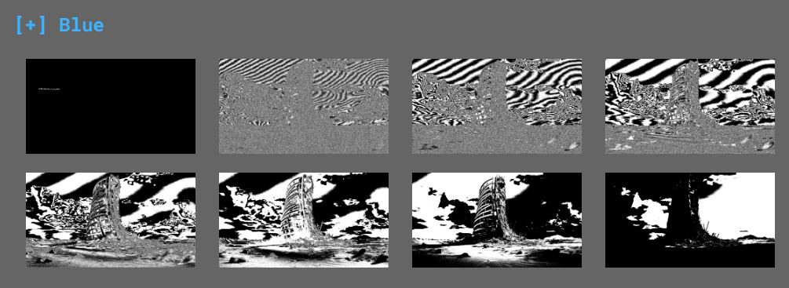

# Whispers of the Past

Using an online service we were able to solve the challenge.

Aperi'Solve is a platform which performs layer analysis on image.
The platform also uses "zsteg", "steghide", "outguess", "exiftool", "binwalk", "foremost" and "strings" for deeper steganography analysis.

The provided image:

Finding:

NTRLGC{this_1z_da_w4y}