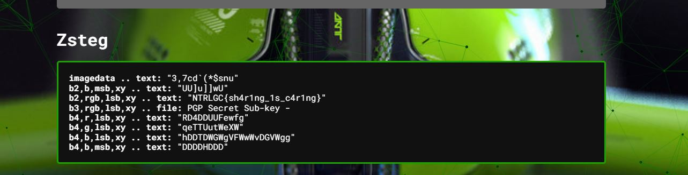

# Blessings for the Future

Using an online service we were able to apply zsteg.

The provided image:

Finding:

Some useful params when using teh command zsteg `[options] filename.png [param_string]` are:
* -b, --bits N  (number of bits)
* -c, --channels X   (channels (R/G/B/A) or any combination, comma separated valid values: r,g,b,a,rg,bgr,rgba,r3g2b3,...)  
* --lsb  (least significant bit comes first)  
* --order xy (pixel iteration order (default: 'auto') valid values: ALL,xy,yx,XY,YX,xY,Xy,bY,...)  

NTRLGC{sh4r1ng_1s_c4r1ng}

