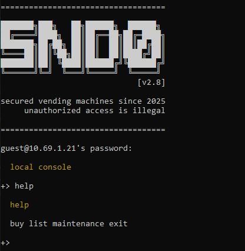
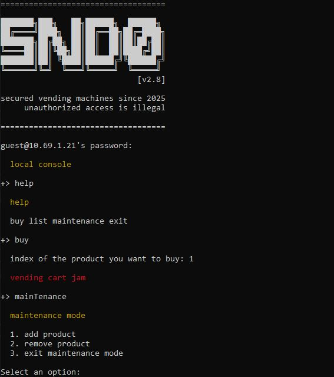
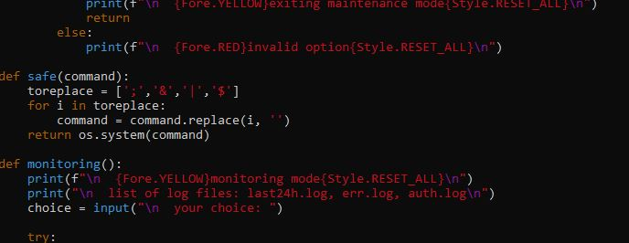
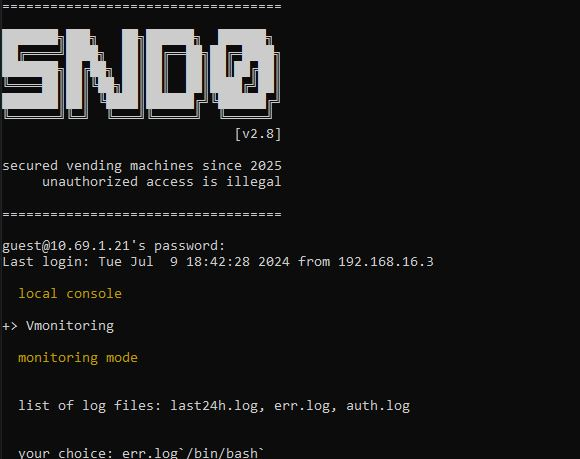
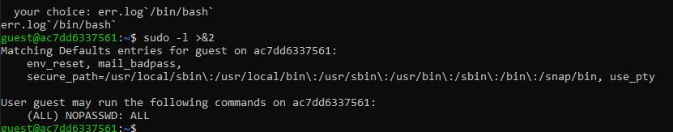
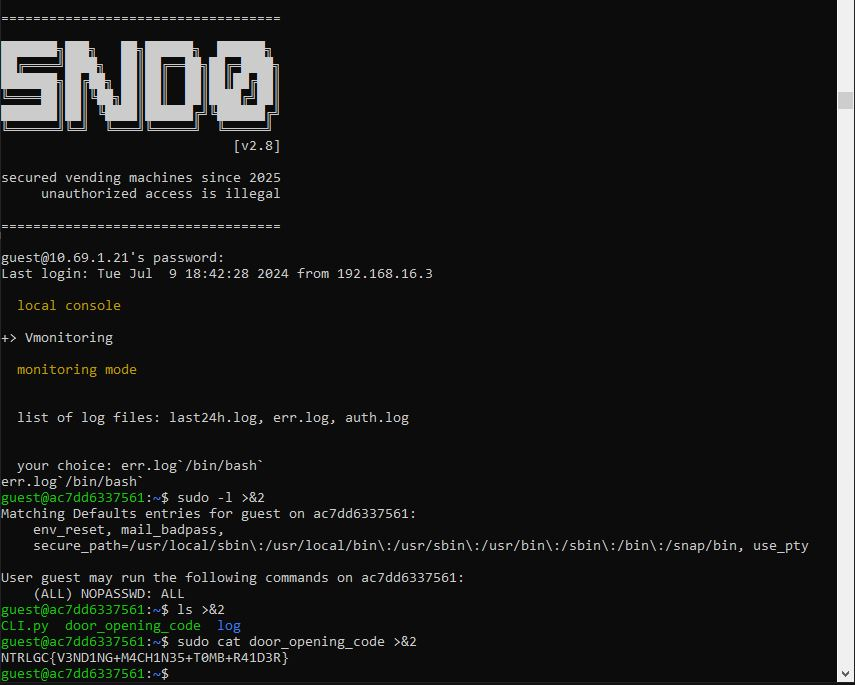

# Vending machine
There is a web page and an ssh access.  
An ssh for guest guest at:  
> ssh guest@<ip> -p <port>  

Jam the vending machine console buying something then enter maintenance mode.

We stopped at maintenance access.



# Official solution
## The (simplified) Vending Machine

Let's see the webpage on port `3332`: ah, it suggests to connect to the vending machine with the `guest` user.

So let's try connecting with `guest:guest`:

```bash
ssh guest@[IP] -p 3333
```


Type `help` to see the available commands.

To bypass restricted access to "maintenance," simply use any uppercase character. For example, `mainTenance`.



#### Steps:

1. **Remove All Products**

2. **Initialization**
   - When prompted if you need to initialize the vending machine, type `y`.

3. **Create Configuration File**
   - Create `vmachine.conf`.

4. **Navigate Filesystem**
   - In `vim`, type `:Sex` to navigate the filesystem.

From vim, go to see the files...!


5. **Open CLI.py**
   - Open the file `CLI.py`.
      - In the simplified version, `CLI.py` is writable, can be edited and an `os.system('/bin/bash')` can be injected and a shell will pop.
         - This was not an expected solution, we made a mistake with the file permissions
         - After this, you can jump to 12 directly
      - In the expected version, `CLI.py` should be executable but not writable, you can ignore the write permissions and continue with point 6

6. **Version Command**
   - Locate the `version` command to obtain the 4ISP advanced glitch.

7. **Locate Function**
   - Find the `safe()` function, which executes system commands. We can use backticks since the character is not included in the array.



8. **Understand Function Calls**
   - `safe()` is called by the `monitoring()` function. By examining the `main()` function, we see that `vmonitoring` is part of the restricted commands.


9. **Logout and Login**
   - Logout and then log back in.

10. **Trigger Monitoring**
    - Type `Vmonitoring`.

Simply use any uppercase character!

11. **Execute Command**
    - At the "your choice:" prompt, type:
      ```shell
      err.log`/bin/bash`
      ```
      to obtain a shell.

Bacause now you know that you can use commands and backticks...




#### Note:
- The output might not be visible since it’s blind, but stderr can be seen.
- Redirect the output of your commands to stderr using `>&2`.




12. **Final Commands**:
    ```shell
    guest@e1c5e03f6f35:~$ sudo -l >&2
    Matching Defaults entries for guest on e1c5e03f6f35:
        env_reset, mail_badpass, secure_path=/usr/local/sbin\:/usr/local/bin\:/usr/sbin\:/usr/bin\:/sbin\:/bin\:/snap/bin, use_pty

    User guest may run the following commands on e1c5e03f6f35:
        (ALL) NOPASSWD: ALL

    guest@e1c5e03f6f35:~$ ls >&2
    CLI.py  door_opening_code  log

    guest@e1c5e03f6f35:~$ sudo cat door_opening_code >&2
    NTRLGC{V3ND1NG+M4CH1N35+T0MB+R41D3R}
    ```


