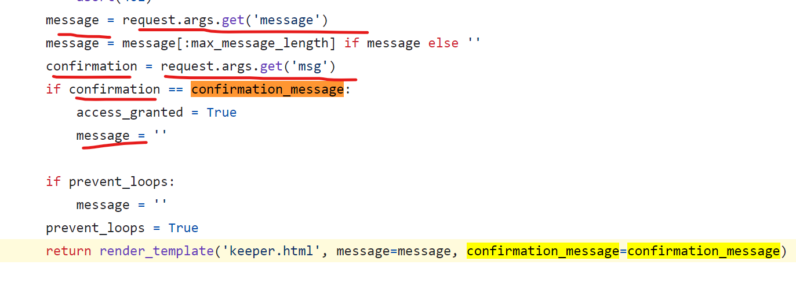
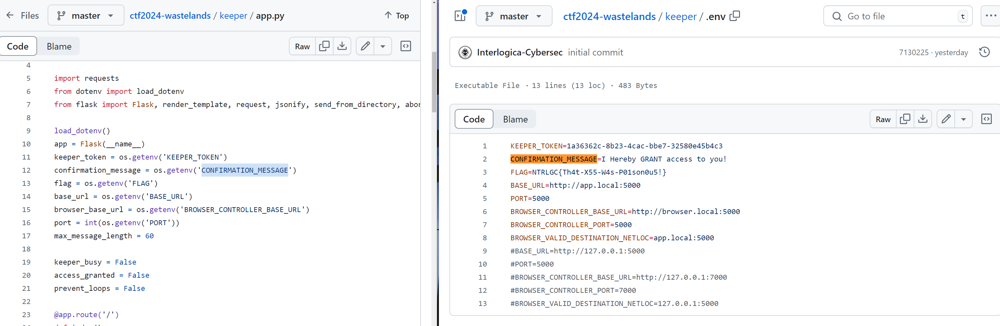
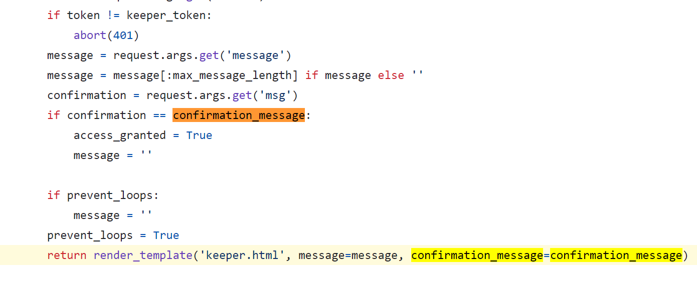

# Keeper

```
There's a bunker relatively close to where we are. I heard it's inhabited by only one old man. Maybe we can convince him to let us in. The bunker is big, there's plenty of room for all of us. Plus we'll be gone in a matter of days.
```

A web page were we can write a text to the keeper (60 chars) and we expect a response form the keeper. Maybe to rest in his bunker...

We are communicating with the bunker dude to gain access! What should we write to him?


# Official solution

By dirbusting (brute force directories and files names on web/application servers) using the provided wordlist we see that the `.git` folder is exposed. We can then use the [git dumper](https://github.com/arthaud/git-dumper) tool to dump the repo.


> git-dumper: A tool to dump a git repository from a website. The tool will first check if directory listing is available. If it is, then it will just recursively download the .git directory (what you would do with wget). If directory listing is not available, it will use several methods to find as many files as possible.

```shell
python git_dumper.py http://[IP]:5020/.git ./dump
```
From the keeper.html template file we can see that a XSS is possible.

Another thing we notice is that the form points to the very same page and uses the GET method.

For this reason we just need to add the confirmation message as the `msg` query parameter to the current URL.




We need to do this in very few characters, so we leverage a regex applied on the inner text of the element with id `wrapper` which we can access directly via dom clobbering (some hints on dom clobbering can be seen in the page, since other elements are accessed in the very same way).

Knowing these things, one possible way to do what we need is to update the `location` variable like this:

```html
<svg/onload=location+='&msg='+wrapper.innerText.split`"`[1]>
```

which is 60 chars long.



`I Hereby GRANT access to you!`

